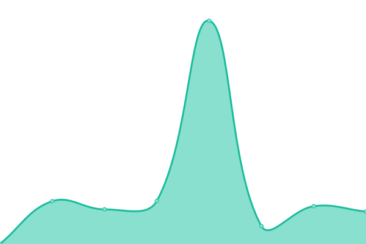

# [📈 Live Status](https://uptime.kee6.tk): <!--live status--> **🟧 Partial outage**

This repository contains the open-source uptime monitor and status page for [Upptime](https://upptime.js.org), powered by [Upptime](https://github.com/upptime/upptime).

With [Upptime](https://upptime.js.org), you can get your own unlimited and free uptime monitor and status page, powered entirely by a GitHub repository. We use [Issues](https://github.com/upptime/upptime/issues) as incident reports, [Actions](https://github.com/Kee7702/api-uptime/actions) as uptime monitors, and [Pages](https://uptime.kee6.tk) for the status page.

<!--start: status pages-->
<!-- This summary is generated by Upptime (https://github.com/upptime/upptime) -->
<!-- Do not edit this manually, your changes will be overwritten -->
<!-- prettier-ignore -->
| URL | Status | History | Response Time | Uptime |
| --- | ------ | ------- | ------------- | ------ |
|  [Zaxno API](https://api.kee6.tk/status) | 🟥 Down | [zaxno-api.yml](https://github.com/Kee7702/api-uptime/commits/HEAD/history/zaxno-api.yml) | 

 3085ms
     
 | 

<a href="https://uptime.kee6.tk/history/zaxno-api">92.56%</a>
    

|  [Kee7702 Replit API](https://api.spookee.tk/status) | 🟩 Up | [kee7702-replit-api.yml](https://github.com/Kee7702/api-uptime/commits/HEAD/history/kee7702-replit-api.yml) | 

 1244ms
     
 | 

<a href="https://uptime.kee6.tk/history/kee7702-replit-api">100.00%</a>
    

<!--end: status pages-->

[**Visit our status website →**](https://uptime.kee6.tk)

## 📄 License

- Powered by: [Upptime](https://github.com/upptime/upptime)
- Code: [MIT](./LICENSE) © [Upptime](https://upptime.js.org)
- Data in the `./history` directory: [Open Database License](https://opendatacommons.org/licenses/odbl/1-0/)
